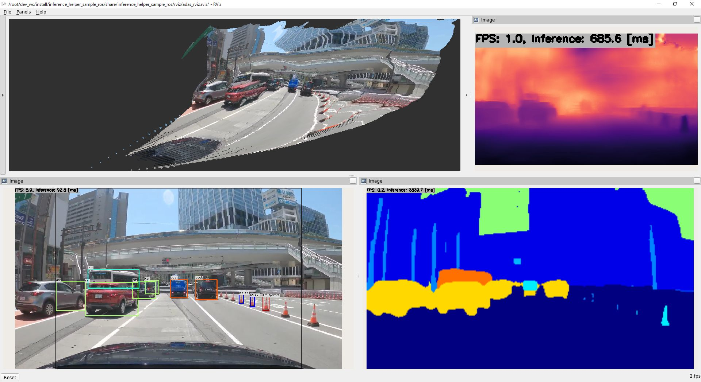
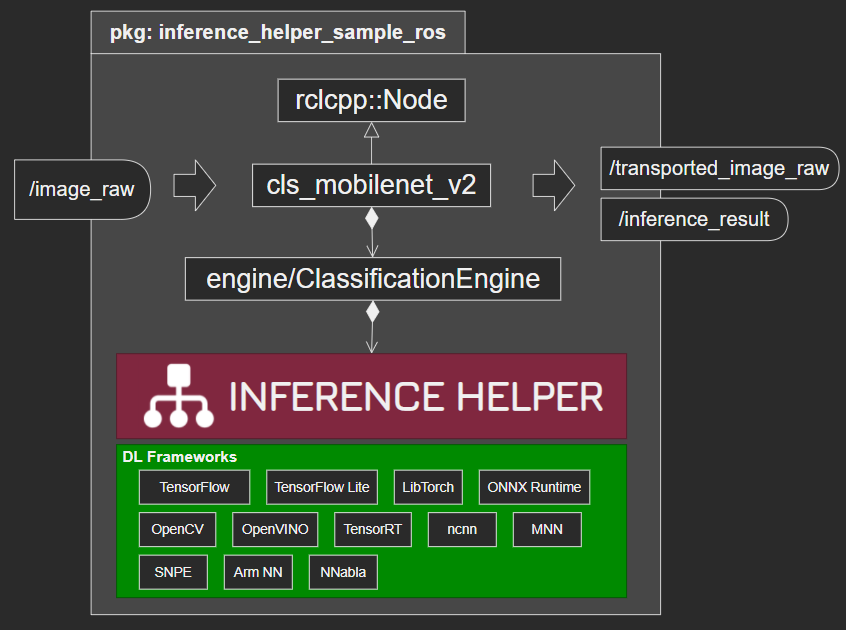
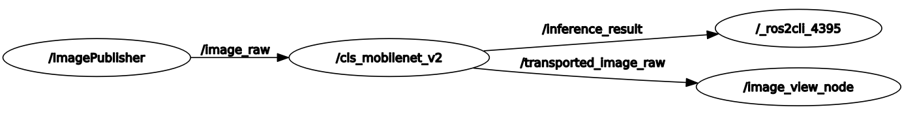

# InferenceHelper_Sample_ROS
- Sample node collection using Inference Helper (https://github.com/iwatake2222/InferenceHelper ) in ROS2



## Tested Environment
- Host PC
    - Ubuntu 20.04
    - Ubuntu 20.04 + Docker
    - Windows 11 + WSL2 (Ubuntu 20.04)
- ROS2 version
    - Foxy

## How to Run
### Create docker container for ROS2
- This is just an example. You can skip this if you have your ROS2 environment in you PC

```sh:in_your_host_PC
xhost local:    # if needed
docker run -it --name ros2_foxy_1 -e DISPLAY=$DISPLAY osrf/ros:foxy-desktop
# docker start ros2_foxy_1
# docker exec -it ros2_foxy_1 /ros_entrypoint.sh bash
```

### Install software

```sh:in_container
# export DISPLAY=192.168.1.2:0   # if needed
apt update && apt install -y libopencv-dev ros-foxy-image-pipeline unzip
```

### Create ROS2 workspace and download this repo
```sh:in_container
mkdir -p ~/dev_ws/src
cd ~/dev_ws/src

git clone https://github.com/iwatake2222/InferenceHelper_Sample_ROS.git
cd InferenceHelper_Sample_ROS
git submodule update --init
sh inference_helper_sample_ros/src/inference_helper/third_party/download_prebuilt_libraries.sh
sh inference_helper_sample_ros/download_resource.sh
```

### Build
```sh:in_container
cd ~/dev_ws
rosdep install -i --from-path src --rosdistro foxy -y
colcon build  --cmake-args -DINFERENCE_HELPER_ENABLE_TFLITE_DELEGATE_XNNPACK=OFF -DINFERENCE_HELPER_ENABLE_ONNX_RUNTIME=ON
# colcon build  --cmake-args -DINFERENCE_HELPER_ENABLE_TFLITE_DELEGATE_XNNPACK=ON -DINFERENCE_HELPER_ENABLE_ONNX_RUNTIME=OFF

### Set library path ###
export LD_LIBRARY_PATH=$LD_LIBRARY_PATH:build/inference_helper_sample_ros/
export LD_LIBRARY_PATH=$LD_LIBRARY_PATH:src/InferenceHelper_Sample_ROS/inference_helper_sample_ros/src/inference_helper//third_party/onnxruntime_prebuilt/linux-x64/lib/
```

- Enable one of `INFERENCE_HELPER_ENABLE_***` options when you build.
- Above commands are just an example. Refer to https://github.com/iwatake2222/InferenceHelper#cmake-options to find more build options
- Note 1
    - Some frameworks may not be supported in your environment
    - Some models may not be supported in your environment / framework you selected
- Note 2
    - You need to specify framework library path
    - There may be a way to avoid it. NEED HELP!!

### Run
- Run manually

```sh
ros2 run image_publisher image_publisher_node src/InferenceHelper_Sample_ROS/resource/dog.jpg
ros2 run inference_helper_sample_ros det_yolox_exe
ros2 run image_view image_view --ros-args --remap image:=/transported_image_raw
```

- Run launch file

```sh
ros2 launch inference_helper_sample_ros det_yolox.launch.py
```

- Run ADAS demo

```sh
ros2 launch inference_helper_sample_ros adas.launch.py
```

## Node Collection
| Node | Tested frameworks | Description |
|------|-------------------| ----------- |
| transport | None | Just transport input image |
| cls_mobilenet_v2 | <ul><li>INFERENCE_HELPER_ENABLE_TFLITE_DELEGATE_XNNPACK</li><li>INFERENCE_HELPER_ENABLE_ONNX_RUNTIME</li></ul> | Classification by MobileNet V2 |
| det_yolox | <ul><li>INFERENCE_HELPER_ENABLE_TFLITE_DELEGATE_XNNPACK</li><li>INFERENCE_HELPER_ENABLE_ONNX_RUNTIME</li></ul> | Detection by YOLOX-Nano |
| seg_paddleseg_cityscapessota | <ul><li>INFERENCE_HELPER_ENABLE_TFLITE_DELEGATE_XNNPACK</li><li>INFERENCE_HELPER_ENABLE_ONNX_RUNTIME</li></ul> | Segmentation by PaddleSeg CityScapesSOTA |
| depth_lapdepth | <ul><li>INFERENCE_HELPER_ENABLE_TFLITE_DELEGATE_XNNPACK</li><li>INFERENCE_HELPER_ENABLE_ONNX_RUNTIME</li></ul> | Depth by LapDepth<br> Point Cloud |

- There are lots of projects which haven't been ported. You can add mode
    - https://github.com/iwatake2222/InferenceHelper_Sample
    - https://github.com/iwatake2222/play_with_tflite
    - https://github.com/iwatake2222/play_with_tensorrt
    - https://github.com/iwatake2222/play_with_ncnn
    - https://github.com/iwatake2222/play_with_mnn
- `Tested frameworks` above are just frameworks I tested. You can try another frameworks

## Node Specs


- Subscribed Topics
    - `/image_raw` (`sensor_msgs/msg/Image` )
- Published Topics
    - `/transported_image_raw` (`sensor_msgs/msg/Image` )
    - `/inference_result`
        - inference_helper_sample_ros_interface/msg/Classification.msg, BoundingBoxList.msg, etc.
        - `sensor_msgs/msg/PointCloud2` (depth)
- Parameters
    - `topic_image_sub`
        - `/image_raw`
    - `topic_image_pub`
        - `/transported_image_raw`
    - `topic_result_pub`
        - `/inference_result`
    - `work_dir`
        - `/root/dev_ws/src/InferenceHelper_Sample_ROS/resource/`
    - `thread_num`
        - 4


# License
- InferenceHelper_Sample_ROS
- https://github.com/iwatake2222/InferenceHelper_Sample_ROS
- Copyright 2022 iwatake2222
- Licensed under the Apache License, Version 2.0

# Acknowledgements
- This project utilizes OSS (Open Source Software)
    - NOTICE.md

